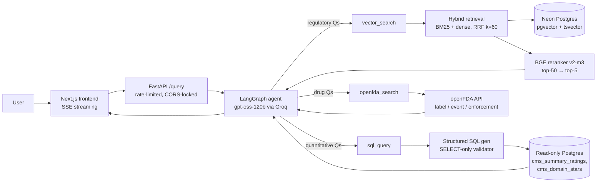

  
# Healthcare RAG Agent

[](https://github.com/alexdomnikov/healthcare-rag-agent/actions/workflows/ci.yml)

A multi-tool RAG agent over CMS healthcare data. The agent routes each question across three tools: hybrid retrieval + cross encoder reranking over the CMS Medicare Advantage & Part D Final Rule PDF, a guarded text-to-SQL tool over the 2026 CMS Star Ratings tables, and an openFDA tool for drug labels, adverse events, and recalls. Built as an end-to-end demonstration of production-grade retrieval: structure-aware chunking, hybrid retrieval with RRF fusion, cross encoder reranking, LangGraph routing, custom LLM-as-judge evaluation, ablation studies, and a streaming FastAPI/Next.js front end.

## Architecture



## Live demo

[healthcare-rag.alexdomnikov.com](https://healthcare-rag.alexdomnikov.com)
  
The first query may take up to a minute while the backend wakes up; Hugging Face Spaces' free tier spins down after inactivity. Subsequent queries are fast under normal load, though Groq's free tier deprioritizes requests during peak times and caps throughput at 8,000 TPM and 200,000 TPD for `openai/gpt-oss-120b`. If responses slow down or stall, that's likely why.

## Metrics

Pre-deployment numbers for the locked-in config. `n` is the slice each metric runs over (29 = all ground-truth questions, 18 = in-corpus document questions, 3 = out-of-corpus refusal questions). Sources: `docs/eval_final.md`, `docs/baseline.md`, `docs/eval_baseline_qwen-qwen3.6-27b.md`.

| Metric | Value | n |
|--------|------:|--:|
| Tool routing accuracy           | 1.000     | 29/29 |
| Retrieval Recall@5              | 1.000     | 18 |
| Retrieval Recall@3              | 1.000     | 18 |
| Retrieval Recall@1              | 0.611     | 18 |
| Retrieval MRR                   | 0.787     | 18 |
| Faithfulness (LLM judge)        | 0.750     | 18 |
| Context precision (LLM judge)   | 0.861     | 18 |
| Context recall (LLM judge)      | 0.639     | 18 |
| Citation precision              | 0.668     | 18 |
| Hallucination rate (OOS)        | 0.000     | 3 |

NOTE: the hallucination rate is meant to be representative rather than comprehensive given the small n.

The LLM-as-judge metrics (faithfulness, context precision, context recall) are computed by a custom async judge built around `qwen/qwen3.6-27b` on Groq in reasoning mode — deliberately a different model family from the `gpt-oss-120b` agent to avoid same-family self-preference bias. Faithfulness grades each answer against the agent's *actual* top-5 retrieved context (not a truncated slice), so a claim grounded in a lower-ranked chunk isn't wrongly marked unsupported. See `eval/llm_eval.py`. Citation precision and hallucination rate are pure regex extraction over the agent's final answers (no judge), fully reproducible from the saved responses. Gold pages and answers were hand-audited against the source rule, and citation precision is scored against that audited gold.

Two design choices worth noting. Questions are phrased the way a real user would ask — colloquial and sometimes vague ("Is there a limit on how much I pay for insulin?") rather than echoing the regulation's language — so routing and retrieval are tested against realistic inputs, not softballs. And faithfulness (0.750) sitting above context recall (0.639) is a telling finding: the agent stays grounded in what it retrieves even when the context is incomplete, so its failure mode is "doesn't answer fully," not "makes things up."

## Ablation studies

All ablations run over the 18 vector search document questions in `eval/ground_truth.json`. Generated by `eval/ablations/run_all.py`.

### 1. Retrieval mode: hybrid vs dense vs lexical

Reranker disabled so the delta reflects only first pass retrieval quality. `top_k=10`.

| Mode    | Recall@1 | Recall@3 | Recall@5 | Recall@10 | MRR   |
|---------|---------:|---------:|---------:|----------:|------:|
| hybrid  | 0.389    | 0.778    | 0.778    | 0.778     | 0.565 |
| vector  | 0.389    | 0.722    | 0.722    | 0.722     | 0.537 |
| lexical | 0.056    | 0.056    | 0.056    | 0.056     | 0.056 |

Hybrid wins on Recall@5 by +0.056 over dense-only and +0.722 over lexical-only. The gap over dense reflects exact-match signals in the CMS corpus (CFR section codes like §422.138, specific dollar figures) that BM25 catches and the embedding model misses; the gap over lexical reflects paraphrase-resistant questions that need semantic matching to surface.

### 2. Reranker: on vs off

Hybrid mode, `top_k=5`. Reranker-on pulls 50 first-pass candidates and rescores; reranker-off returns the raw hybrid top 5.

| Condition    | Recall@1 | Recall@3 | Recall@5 | MRR   |
|--------------|---------:|---------:|---------:|------:|
| reranker off | 0.389    | 0.778    | 0.778    | 0.565 |
| reranker on  | 0.611    | 1.000    | 1.000    | 0.787 |

Reranking lifts Recall@5 by +0.222 and MRR by +0.222. The cross encoder rescores 50 candidates rather than just the top 5, surfacing chunks that hybrid ranks between 6th and 50th. The hybrid stage is strong on recall but mediocre on precision; the cross encoder corrects that.

### 3. Chunking strategy: structure aware vs fixed size

Hybrid mode, reranker off, `top_k=10`. Structure aware = Docling HybridChunker @ 400 tokens. Fixed size = 400 token windows with 50-token overlap.

| Strategy        | Recall@1 | Recall@3 | Recall@5 | Recall@10 | MRR   |
|-----------------|---------:|---------:|---------:|----------:|------:|
| structure-aware | 0.389    | 0.778    | 0.778    | 0.778     | 0.565 |
| fixed-size 400  | 0.389    | 0.778    | 0.833    | 0.889     | 0.576 |

Fixed size wins raw Recall@5 by +0.056 and MRR by +0.011. The likely reason is that many structure-aware chunks end up smaller than their 400-token cap due to the HybridChunker's soft limit and merge_peers=True behavior, while fixed windows always fill their budget and capture more context per chunk. This was unavoidable, as raising HybridChunker's cap to 512 led to many chunks with 600-700+ tokens, which led to excessive truncation. Structure aware is kept in production anyway because it preserves section_path metadata that produces cleaner citations, which is a judgment the retrieval metrics don't capture. This is the one ablation where the numerical winner wasn't shipped.

## Tech stack

- **Agent runtime**: LangGraph via `langchain.agents.create_agent` — graph-based tool routing with clean per-event streaming hooks.
- **LLM**: `openai/gpt-oss-120b` on Groq — fast tool-call latency, `reasoning_effort="low"` to keep thinking tokens minimal while streaming.
- **Embedder**: `BAAI/bge-small-en-v1.5` (384-dim) — strong quality-per-byte; cheap to host alongside pgvector.
- **Reranker**: `BAAI/bge-reranker-v2-m3` cross encoder — open weights to dodge rate-limited reranker APIs.
- **Vector store**: pgvector on Neon Postgres — single database for vectors, tsvector lexical index, and the Star Ratings tables.
- **Hybrid retrieval**: BM25 (`ts_rank_cd`) + dense (cosine via `<=>`) fused with Reciprocal Rank Fusion in a single SQL round-trip (`src/healthcare_rag/retrieval.py`).
- **Chunker**: Docling `HybridChunker` (max 400 tokens, `merge_peers=True`) for structure-aware chunks with `section_path` metadata.
- **PDF parser**: Docling `DocumentConverter` — layout-aware extraction with page-level provenance.
- **LLM judge**: `qwen/qwen3.6-27b` on Groq in reasoning mode — grades faithfulness against the agent's actual top-5 retrieved context, with a custom async rate limiter for the free-tier token budget. Deliberately a different model family from the agent to avoid same-family self-preference bias.
- **API**: FastAPI + SlowAPI rate limiting + SSE streaming + locked down CORS allowlist.
- **Frontend**: Next.js 16 / React 19 on Vercel, with a disclaimer gate and streaming message bubble.
- **MCP server**: FastMCP over stdio — exposes the same three tools to any MCP client (Claude Desktop, Claude Code, etc.) without the FastAPI layer.
- **Deployment**: Dockerfile + docker compose for the API hosted on Hugging Face Spaces (auto-deployed from `main` via GitHub Actions after CI passes); Vercel for the frontend.

## Design decisions

- **Hybrid + rerank, not fine tuning.** Ablation 2 shows the cross encoder buying +0.222 Recall@5 with no model training. Fine-tuning a domain embedder on 18 hand-written questions might have been overfit for this corpus size; the cross encoder generalizes for free.
- **pgvector on Neon over Pinecone/Weaviate.** One Postgres deployment hosts the dense index, the BM25 `tsvector` index, and the relational Star Ratings tables, so the hybrid SQL query in `retrieve_hybrid` is one round trip instead of two service calls plus an application-side fuse.
- **LangGraph agent loop instead of a hand-rolled router.** The `astream_events` API gives clean `on_tool_start` / `on_chat_model_stream` events that map directly to SSE tokens, with no glue code between the LLM and the front end.
- **Three tools, no more.** Each tool maps to a distinct data shape (unstructured doc / structured rows / external API), which is what makes the routing problem learnable from the system prompt alone. Routing accuracy is 1.000 (29/29) with zero few-shot fine tuning on the router.
- **Guarded text-to-SQL, not freeform.** `sql_query` uses structured output (Pydantic schema), a SELECT-only regex validator, a forbidden keyword check, and a read only Postgres role. Three independent layers, because one is not enough.
- **Citations are graded.** `[p. N]` markers are required by the system prompt and graded by `citation_precision` over the gold pages. The model is rewarded for grounding, not just for being right.
- **No auth, by design.** This is a public demo. Defense-in-depth is the read-only DB role, the SlowAPI per-IP rate limit, a 90s query timeout, and a hardcoded CORS allowlist. A production version would add JWT auth, rate limiting per user, audit logging.
- **Groq as the LLM provider.** Tool calling latency is the bottleneck in agent loops; Groq's TPS on `gpt-oss-120b` keeps the agent responsive enough to stream interactively.

## Future work

What an enterprise version would add:

- **Intelligent model router.** Dispatch easy lookups to a small fast model and only escalate to a frontier model for compounded reasoning, with budget-aware fallback on rate-limit errors.
- **Fine-tuned reranker on synthetic pairs.** Generate hard negatives from the CMS corpus using an LLM, then fine tune `bge-reranker-v2-m3` against them; current reranker is off-the-shelf.
- **Multi-document ingestion.** Today the corpus is one PDF. The schema already carries `document_source`; the missing piece is a corpus manager that handles versioned re-ingestion when CMS publishes updates.
- **Autonomous monitoring agent.** A scheduled agent that re-runs the eval suite against the latest models, watches for drift in faithfulness or citation precision, and opens a tracking issue when a metric drops below threshold.
- **Per-document access controls and audit logs.** A real deployment needs row-level security on the SQL tool and a query-log table for compliance review.
- **Self-hosted inference to escape free-tier limits.** Groq's free tier constrains both paths: the live agent hits per-minute and per-day token caps and gets deprioritized at peak (the latency the Live demo section notes), while the eval judge is throttled to ~2 calls/minute (~25-minute runs). Serving the models on dedicated infrastructure (e.g. Modal or vLLM) would remove those ceilings — steadier, faster demo responses and much shorter eval runs — at the cost of paid GPU time, worth it once traffic or eval frequency justifies the spend.

## Local development

**Prerequisites**

- Python 3.12 (`uv` recommended)
- pnpm (for the frontend)
- A Neon Postgres database with the `vector` extension enabled
- A Groq API key
- A Hugging Face token (for model downloads)

**Setup**

 ```bash   
  # 1. Install dependencies
  uv sync --extra eval
  
  # 2. Configure environment
  cp .env.example .env
  # Required: DATABASE_URL, DATABASE_URL_READONLY, GROQ_API_KEY, HF_TOKEN
  # Optional: LANGSMITH_KEY / LANGSMITH_TRACING / LANGSMITH_PROJECT for tracing
  ```
  
  **3. Create the chunks table** — run once in the Neon SQL editor:
  
  ```sql
  CREATE EXTENSION IF NOT EXISTS vector;

  CREATE TABLE chunks (
      id              SERIAL PRIMARY KEY,
      text            TEXT NOT NULL,
      embedding       vector(384),
      page_number     INTEGER,
      section_path    TEXT,
      document_source TEXT NOT NULL,
      chunk_strategy  TEXT NOT NULL,
      tsv             TSVECTOR GENERATED ALWAYS AS (to_tsvector('english', text)) STORED
  );
  
  CREATE INDEX chunks_embedding_idx ON chunks USING hnsw (embedding vector_cosine_ops);
  CREATE INDEX chunks_tsv_idx       ON chunks USING gin (tsv);
  CREATE INDEX chunks_strategy_idx  ON chunks (chunk_strategy);
  ```
  
  ```bash
  # 4. Load the structured Star Ratings tables
  uv run python scripts/load_cms_tables.py
  
  # 5. Parse, chunk, embed, and store the CMS Final Rule PDF
  uv run python scripts/ingest.py --strategy hybrid
  # Optional second pass for the chunking ablation:
  uv run python scripts/ingest.py --strategy fixed

  # 6. Run the API
  uv run uvicorn healthcare_rag.api.main:app --reload
  # or via Docker:
  docker compose up --build

  # 6b. (Optional) Run the MCP server for use with Claude Desktop / Claude Code
  uv run python src/healthcare_rag/mcp_server.py
  # To test interactively with the MCP Inspector UI:
  uv run fastmcp dev inspector src/healthcare_rag/mcp_server.py

  # 7. Run the frontend (in another shell)
  cd frontend && pnpm install && pnpm dev
  ```

**Evaluation**

```bash
# Generate agent responses (~15 min, ~29 agent calls)
uv run python eval/generate_responses.py

# Retrieval metrics (Recall@k, MRR): ~30 s, no LLM calls
uv run python eval/metrics.py

# LLM-judge metrics (faithfulness, context precision/recall): ~30 min, sequential + de-bursted
uv run python eval/llm_eval.py

# Tool-routing eval (full)
uv run python eval/routing_eval.py

# Ablation suite: rewrites docs/ablations.md
uv run python eval/ablations/run_all.py

# CI smoke subset (what GitHub Actions runs on every push)
uv run python eval/run_eval.py --subset smoke
```

Most of that runtime is the judge step: 54 calls (three metrics across the 18 document questions). The calls are issued concurrently, but the free-tier Qwen judge is throttled to ~2 calls/minute to stay under Groq's per-minute token cap, so the wall-clock is bounded by the rate limit rather than by concurrency.

## Repository structure

```
.
├── src/healthcare_rag/
│   ├── api/main.py          # FastAPI app: /health, /query (SSE), rate limiting, CORS
│   ├── core.py              # Lazy singletons: embedder, reranker, engines, agent, LLM
│   ├── retrieval.py         # Dense / lexical / hybrid (RRF) + cross-encoder rerank
│   ├── mcp_server.py        # FastMCP server: exposes all three tools over stdio
│   ├── eval_metrics.py      # recall_at_k, reciprocal_rank. Shared by all eval scripts
│   └── tools/               # vector_search, sql_query (guarded), openfda_search
├── eval/
│   ├── ground_truth.json    # 29 hand-written questions (18 doc, 5 SQL, 3 FDA, 3 OOS)
│   ├── generate_responses.py# Runs the agent over ground_truth, saves trace + chunks
│   ├── metrics.py           # Retrieval Recall@k and MRR
│   ├── llm_eval.py          # Custom async LLM-as-judge w/ sliding-window rate limiter
│   ├── routing_eval.py      # Tool-routing accuracy and misroute breakdown
│   ├── run_eval.py          # CI orchestrator with pass/fail thresholds
│   └── ablations/           # Three ablation runners + run_all.py
├── scripts/
│   ├── ingest.py            # PDF → chunks → embeddings → pgvector (hybrid or fixed)
│   ├── load_cms_tables.py   # Star Ratings CSVs → Postgres tables
│   └── smoke_*.py           # Manual smoke tests for each tool
├── docs/
│   ├── eval_final.md        # Pre-deployment headline numbers
│   ├── ablations.md         # Auto-generated ablation report
│   ├── baseline.md          # Retrieval Recall@k snapshot
│   └── eval_baseline_*.md   # Per-judge LLM-eval baselines
├── tests/                   # pytest: retrieval smoke + openFDA tool tests
├── data/                    # CMS PDF + 2026 Star Ratings CSVs
├── frontend/                # Next.js 16 + React 19 chat UI with SSE streaming
├── Dockerfile               # API image (uv sync --frozen --no-dev --no-group eval)
├── docker-compose.yml       # Single-service compose for local API
└── .github/workflows/ci.yml # Lint + tests + smoke eval (reranker disabled on CPU runners)
```
